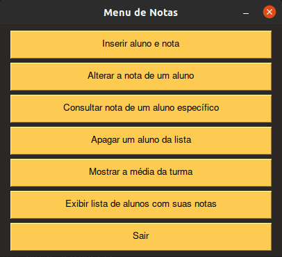

# Menu_escola
Programa simples para aplicação de conceitos da linguagem python

- Foi utilizado a biblioteca <a href="https://pysimplegui.readthedocs.io/en/latest/" target="_blank">PySimpleGUI</a> para gerar a interface gŕafica

- Como projeto futuro pretendo criar um banco de dados para armazenar os valores e também criar um executável do programa

#### Screenshot do programa:

